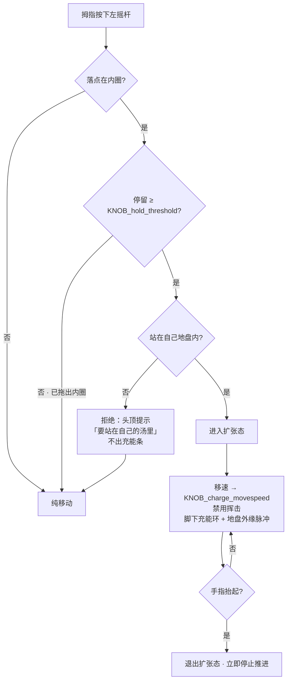
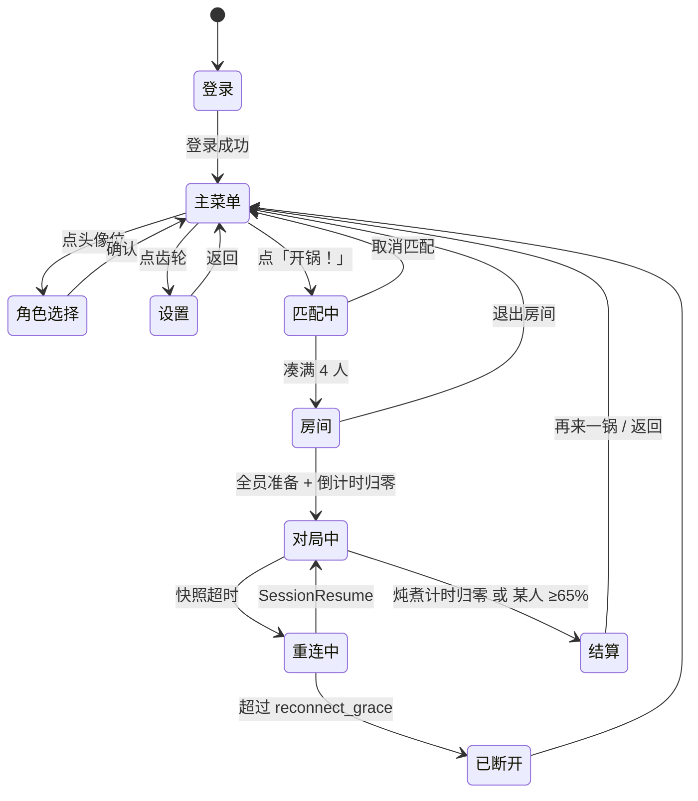

# A0001 SoupOut · 美术音频规格文档 (ASD)

> 定位符：`A0001M{模块}F{功能}`
> 上位：`G0001SoupOut`（玩法）· `rules/design-system.md`（视觉基调）
> 相关：`T0001M04F01`（预测分工，决定音效时机）· `T0001M03F08`（地盘渲染）
> 客户端：**Godot 4.x 原生** · 2D 俯视 · 平板/PC 为主，手机兼容

## Version History

| 版本 | 变更 |
|---|---|
| v0.1 | 首版。**本版只锁「硬约束」与「要做什么」的清单**，具体制作规范（分辨率、命名、处理链）等 P0 出画面后补 |
| v0.2 | 客户端补齐 `M06`–`M15`：**布局 / HUD / 地图 / 摄像机 / 全流程界面 / 资产清单**。补上 `G0001M02F02`、`G0001M04F01` 两处悬空的「详见 A0001」引用 |
| v0.2 | 输入定型：**左摇杆双环（外圈移动 / 内圈长按扩张）+ 右摇杆方向挥击** |
| v0.2 | 摄像机定型：**跟随角色 + 按质量档位分级 zoom**（曾评估「固定全锅一屏」，已推翻，理由见 `M10F01`） |
| v0.2 | 角色名单定型：**排骨 / 紫菜 / 玉米 / 茄子**；四色色值由 `M05` 待定项落地到 `M07F01` |
| v0.2 | 地图定型：**严格 4 重旋转对称 · 5 组团 · 8 板 12 窗 · 含墙体**，并新增地图机制 **「搅一搅」**（`M09F07`） |
| v0.2 | 界面范围定型：**全流程**（登录 / 主菜单 / 角色选择 / 匹配 / 房间 / 设置 / 结算 / 重连） |
| v0.3 | 按 `T0005SoupClientGodot` 对齐协议：主菜单补**房间码入口**；角色选择改为「主菜单选偏好、房间内可改」；登录页明确**零网络请求**；边界渲染实现改为 **GPU shader**（视觉规格不变）；field 纹理为 `Nearest` 的**唯一例外** |

## A0001M00F00 本文当前的定位

现在写详细制作规范会写成空话——没有画面、没有手感、连单局时长都还没定。
**所以本版只做两件事：**
1. 把**做素材之前必须定死的约束**写下来（定晚了要返工）
2. 把**要做哪些东西**列成清单（供排期和采购）

## A0001M00F01 本文导航

| 模块 | 内容 | 主要读者 |
|---|---|---|
| `M01`–`M03` | **音频**：核心命题 · 硬约束 · 资产清单 | 音频 |
| `M04`–`M05` | **美术硬约束** · v0.1 待定项 | 主美 |
| `M06` | 客户端布局总则：画布 / 安全区 / 渲染层序 | 客户端 · TA |
| `M07` | 色彩与可读性系统（**五色具体值 + 图案 + 边界渲染**） | 主美 |
| `M08` | 角色规格：名单 / 体型分级 / 动画表 | 执行美术 |
| `M09` | **战场地图布局** + 地图机制「搅一搅」 | 主策 · 主美 |
| `M10` | 摄像机与视野 | 客户端 |
| `M11` | **战斗 HUD 布局** | 客户端 · UI |
| `M12` | 战斗内反馈与 VFX（含打击感） | TA · 特效 |
| `M13` | 全流程界面 | UI |
| `M14` | 资产清单与命名规范 | 全体 |
| `M15` | 待确认与回写建议（与 `M05` 合并阅读） | 主策 |

> **`M06` 起为客户端职责范围：只定布局、尺寸、状态、可读性规则与资产清单。具体画面由美术实现，本文不出成品图。**

---

# M01 音频 · 核心命题

## A0001M01F01 这个游戏的音频有一个非常规问题

核心动词是**「按住扩张」**——持续数秒、有渐进感、角色同步变大。**one-shot 音效撑不住。**

其余全是常规活。所以优先级是死的：

| 优先级 | 内容 | 做法 |
|---|---|---|
| 🔴 **必须做对** | **扩张的连续声** | 1 个循环层，音高 + 低通截止跟随扩张进度上行；松手播收尾。**一个素材 + 约 20 行代码** |
| 🟡 常规 | 命中 / 死亡 / 推板子 / 翻窗 / 拾取 | one-shot，体力活 |
| 🟢 够用就行 | 炖煮 BGM 演化 | **不做 stem 分层**。一首曲子 + 随锅温打开的低通；或两首在 50% 处交叉淡化 |
| 🟢 顺手 | 质量影响音色 | 给挥击/脚步挂一个跟质量走的滤波参数，**不另做素材** |

> 一个人做游戏，把 🔴 做透、其余够用，远好过四条都做一半。

## A0001M01F02 音色方向：厨房 foley

**禁止电子音** —— 与暖色马赛克 Q 版食物完全不搭。

全部素材来自厨房实物：咕嘟、滋啦、水花、锅铲刮锅、瓷器碰撞、切菜、盖锅盖。

**音乐同理：拿锅碗瓢盆当打击乐器。** 马林巴 / 拨弦打底 + 厨房器物做节奏层。贴题，且是最省成本的方向。

---

# M02 音频 · 硬约束【做素材之前必须定，定晚了返工】

## A0001M02F01 平板外放的现实

| 约束 | 原因 |
|---|---|
| **力量感全部放在 300 Hz – 4 kHz** | iPad 外放听不见低频。低频上花的功夫等于零 |
| **SFX 全部单声道** | 外放没有立体声感知，还省一半内存 |
| 音乐可立体声 | 玩家戴耳机时的唯一收益点 |
| 响度归一化，避免大动态 | 外放环境噪声高，弱音直接消失 |

## A0001M02F02 并发与优先级

4 人混战 + 环境咕嘟 + BGM，不限并发当场糊成一团。

| 项 | 值 |
|---|---|
| SFX 同时 voice 上限 | **16** |
| **自己的音效永远抢占别人的** | 优先级：Self > 近处敌人 > 远处 > 环境 |
| 同类音效合并窗口 | 30ms 内的同类 one-shot 只播一个 |
| 距离衰减 | 超出屏幕范围的事件不播 |

## A0001M02F03 Bus 结构

```
Master
├── Music
├── Ambience        （汤锅咕嘟底噪）
├── SFX
│   ├── Self        ← 响的时候把 Others 压 3 dB (sidechain duck)
│   └── Others
└── UI
```

## A0001M02F04 音效时机 —— 这是正确性，不是打磨

> 对应 `T0001M04F01` 的预测分工。**反过来做等于把 RTT 塞进打击感里。**

| 音效 | 何时播 |
|---|---|
| **挥舞前摇** | **客户端按下立即播**，不等服务器 |
| **命中** | **等服务器确认**（`0x0C0 Snapshot` / 事件） |
| 扩张充能 | 客户端立即播（自己向原汤的扩张是预测的） |
| 扩张被顶住（僵持） | 等服务器（争议边界不预测） |
| 翻窗 / 推板子起手 | 客户端立即播（交互有自然前摇，正好掩盖 RTT） |
| 死亡 / 复活 / 拾取 | 等服务器 |

## A0001M02F05 技术选型

**Godot 内置音频 + 自写薄音频层**（bus 管理、voice pool、优先级、参数插值）。

不上 Wwise / FMOD：这个体量，授权与集成成本换不回收益，而那层薄封装不管用什么中间件都得写。

---

# M03 音频 · 资产清单

> 🔴 = P0/MVP 必须；🟡 = P1；🟢 = 打磨期

### 环境与音乐
| # | 资产 | 优先级 |
|---|---|---|
| 1 | 对局 BGM 主曲（可循环，覆盖单局时长） | 🟡 |
| 2 | 锅温演化（低通自动化曲线 或 第二版曲子） | 🟢 |
| 3 | 汤锅环境底噪（咕嘟循环） | 🔴 |
| 4 | 大厅 BGM | 🟢 |

### 核心动作（🔴 全项目最重要）
| # | 资产 | 优先级 |
|---|---|---|
| 5 | **扩张充能循环**（可变音高 + 低通） | 🔴 |
| 6 | 扩张起手 | 🔴 |
| 7 | 扩张收尾（松手） | 🔴 |
| 8 | 扩张被顶住 / 僵持（循环或提示音） | 🟡 |
| 9 | 抢占敌方地盘（音色区别于开荒） | 🟡 |

### 移动与地形
| # | 资产 | 优先级 |
|---|---|---|
| 10 | 跳动脚步（饥荒式一跳一跳），走滤波区分轻/重 | 🔴 |
| 11 | 翻窗起手 / 完成 | 🔴 |
| 12 | 推板子：推倒 / 砸中 / 被击碎 | 🔴 |
| 13 | 撞锅沿 | 🟢 |

### 战斗
| # | 资产 | 优先级 |
|---|---|---|
| 14 | 挥舞前摇 | 🔴 |
| 15 | 命中（轻 / 重两档） | 🔴 |
| 16 | 受击 | 🔴 |
| 17 | 死亡（食材散架 + 地盘化汤的"泄气"） | 🔴 |
| 18 | 复活 | 🟡 |

### 道具
| # | 资产 | 优先级 |
|---|---|---|
| 19 | 饮料罐落水（啪嗒 + 水花） | 🟡 |
| 20 | 拾取 | 🟡 |
| 21 | 三种 buff 各自的生效音 | 🟡 |

### UI 与播报
| # | 资产 | 优先级 |
|---|---|---|
| 22 | 按钮 / 准备 / 房间码输入 | 🔴 |
| 23 | 开局倒数 | 🔴 |
| 24 | 击杀播报 | 🟡 |
| 25 | 炖煮里程碑（过半 / 最后 30 秒） | 🟡 |
| 26 | 结算（第 1 名 / 其他名次） | 🟡 |

### 角色拟声（可选）
| # | 资产 | 优先级 |
|---|---|---|
| 27 | 4 食材 × 3–5 句短拟声（不说话，"呀""噗"这类 Q 版） | 🟢 |

**合计约 50 个资产**，其中 🔴 约 18 个。

---

# M04 美术 · 已定的硬约束

> 来自 `rules/design-system.md` 与玩法推导。**这些定晚了要返工，其余等 P0。**

## A0001M04F01 基调（已定）

2D 俯视 · 暖色 · **马赛克风格边缘** · Q 版食物 · 大眼睛 · 饥荒式一跳一跳的走路动感 · 攻击是简单有力的挥舞。

## A0001M04F02 角色必须能连续缩放【玩法硬需求】

角色体型随**地盘面积**实时变化（`G0001M02F02`）——从 10% 到 65%，体型跨度很大。

因此角色素材必须满足：
- 要么是**能优雅缩放的矢量/单图**（缩放时线宽和眼睛比例需单独控制，否则大号角色会糊、小号角色眼睛会占满脸）
- 要么做 **3–4 档体型**（瘦/中/胖/巨）在阈值处交叉淡化

**这条不先定，角色美术做完可能整套重来。** 建议 P0 原型里就用占位图把缩放范围试出来。

## A0001M04F03 四色必须可区分且色盲友好【玩法硬需求】

地盘归属靠颜色读，**读错颜色 = 读错局势**。

- 4 个玩家色 + 原汤色 = **5 个必须一眼区分的色**
- 必须过**红绿色盲**校验（约 8% 的男性玩家）
- 暖色基调下要凑出 4 个高区分度的色本身就难，**这是配色阶段的主要约束，不是事后调**
- 建议：除颜色外再加**图案纹理**（点/条/网格）作为第二重区分，色盲玩家可靠纹理读

## A0001M04F04 地盘边界渲染（对应 `T0001M03F08`）

- 96×96 网格 → **marching squares 抽等值线 + 轻度平滑**，不直接画格子
- 新翻转的格做 **150ms 漫开渐变**，掩盖 10Hz 的离散感
- 边缘保留轻微像素颗粒 —— **正好对上马赛克边缘的基调，这不是妥协**

## A0001M04F05 可读性清单

| 要素 | 要求 |
|---|---|
| 板子（立着 / 倒下 / 碎了） | 三态必须一眼分清 |
| 翻窗点 | 远处就能看见，否则拉扯打不起来 |
| 「过重，下不了板子」 | 角色身上要有持续的视觉标记，不能只靠玩家记数值 |
| 充能中 | 角色 + 地盘边缘同时给反馈（这是核心爽点） |
| 濒死 / 死亡流失中 | 地盘要肉眼可见地在缩 |

---

# M05 待定

| 项 | 何时定 | 影响 |
|---|---|---|
| **音频是自己录、买素材、还是外包** | 尽快 | 决定 A0001 v0.2 写成「录音清单 + 处理链」还是「采购清单 + 筛选标准」 |
| 单局时长 | P0 测出 `expandRate` 后 | BGM 长度 |
| 角色缩放方案（矢量 vs 体型档） | P0 原型试出来 | 角色美术全部工作量 |
| 四色具体色值 | 配色阶段 | —— |
| 详细制作规范（分辨率 / 命名 / 图集 / 采样率） | P0 之后 | —— |

> v0.2 更新：本表中「角色缩放方案」已在 `M08F02` 落地为三档方案，「四色具体色值」已在 `M07F01` 给出。其余待定项与新增待定项合并见 `M15`。

---

# M06 客户端布局总则

## A0001M06F01 平台与画布

| 项 | 取值 |
|---|---|
| 主力设备 | **平板触屏 + PC**（与 `design-system.md`、`G0001M10` 一致） |
| 兼容设备 | 手机横屏。**只要求「不坏」，不为它牺牲布局** |
| 屏幕方向 | **横屏锁定**，不做竖屏 |
| 基准画布 | **1920 × 1080** |
| 比例区间 | 最窄 4:3（iPad） ~ 最宽 19.5:9（手机） |
| 语言 | **仅 zh-CN**。但所有文案走 `.tr()`，**不得把文字烧进贴图** |

**Godot 项目设置（必须照此配）**

| 键 | 值 | 理由 |
|---|---|---|
| `display/window/stretch/mode` | `canvas_items` | UI 按比例缩放 |
| `display/window/stretch/aspect` | `expand` | 宽屏给出左右余量，而不是黑边或裁切 |
| `display/window/stretch/scale_mode` | `integer` | 马赛克风格必须整数缩放 |
| `rendering/.../default_texture_filter` | `Nearest` | **全项目禁用双线性过滤** |

> ⚠️ 这两条与 `M04F01` 的「马赛克风格边缘」是绑定的。一旦开了线性过滤，所有边缘会糊成灰边。**这不是偏好，是风格的技术前提。**
>
> **唯一例外**：地盘场的 field 纹理（`T0005M07F05`）必须在其材质上单独覆盖为 `Linear` —— `M07F03` 第 ① 层的平滑有机边界全靠它。这是**有意的例外**，代码里有注释，Review 时不要改回 `Nearest`。

## A0001M06F02 安全区（以**屏幕短边**为基准，不以长边）

| 区域 | 定义 | 规则 |
|---|---|---|
| **UI 安全边距** | 短边 × 4% | 所有 UI 不得越界（避 iPad 圆角 / 手机刘海 / Home 指示条） |
| **拇指禁区** | 左下 · 右下各一个 半径 = 短边 × 30% 的四分之一圆 | **禁止放置任何关键可读元素与关键 VFX**。摇杆就在这里，拇指必然遮挡 |
| **角色锚点** | 屏宽 50% · **屏高 44%** | 角色锁在中心**偏上**，把下方让给两个摇杆 |

**Player Story**
> As a 平板玩家, I want to 两个拇指压在屏幕下沿时，我的角色和它脚下正在发生的事都不被自己的手挡住, so that I feel 这游戏是给触屏做的，不是把键鼠界面搬过来的。

## A0001M06F03 渲染层序（硬规则，不得调换）

```
1  汤底           静态汤面底图 + 缓慢流动
2  地盘场         TerritoryField（marching squares 等值线，见 M07F03）
3  地面 VFX       充能环 / 挤压涌动 / 化汤气泡 / 搅拌预警带 / 道具落点影
4  地形           墙体 / 板子 / 窗
5  角色           4 名玩家 + 掉落物
6  角色上 VFX     挥击轨迹 / 受击 / 无敌环 / 头顶提示
7  HUD            CanvasLayer，独立于世界坐标
```

## A0001M06F04 硬规则：地形不得遮挡地盘边界

> `G0001M02F04` 要求「画面永远读得懂」。地盘边界是**全游戏唯一的核心读数**——攻防、成长、排名全从它派生。**任何东西盖住它就等于盖住了游戏本身。**

| 要求 | 做法 |
|---|---|
| 墙体走**矮平面俯视足迹** | 不画侧立面、不画投影墙面。视觉假高 ≤ 0.25 个角色身高 |
| 墙体**内部镂空** | 中心区域半透（α ≈ 0.35），让下方地盘色透出来 |
| 用**描边 + 图案**表达体积 | 不用大面积实心色块 |
| 倒地板**必须比站立板更透** | 倒地板贴地，遮挡面积最大，是最危险的一个 |

```gherkin
Scenario: 墙体不吃掉地盘边界读数
  Given 一段地盘边界正好横穿一段墙体
  When 玩家看向该区域
  Then 边界线在墙上仍然连续可见，不出现断口
  And 墙两侧的地盘归属色仍然可分辨
```

---

# M07 色彩与可读性系统 【一等资产】

> 这一节落地 `M04F03` 的待定项。**四色地盘 + 原汤色是本作最重要的一张资产，比任何一个角色都重要。** 玩家 90% 的决策来自读这五种颜色。

## A0001M07F01 五色系统（落地 `M05` 的「四色具体色值」）

| 归属 | 主色（地盘） | 深色（边界描边） | 亮色（充能脉冲） |
|---|---|---|---|
| **原汤**（中性） | 低饱和米褐 `#B99A72` | `#8E7050` | — |
| **排骨** P1 | 暖粉红 `#F2909B` | `#C0566A` | `#FFC3CB` |
| **紫菜** P2 | 深青绿 `#2E9A86` | `#175E52` | `#6EE0C6` |
| **玉米** P3 | 明黄 `#FFD21E` | `#C79600` | `#FFF08A` |
| **茄子** P4 | 紫罗兰 `#8B5CD6` | `#563394` | `#C4A6F5` |

**调色时必须守住的三条**

1. **原汤必须是五色里唯一低饱和的。** 中性区在语义上就该「没人要」，压饱和度是最直接的表达
2. **玉米（明黄）与原汤（米褐）是唯一有冲突风险的一对。** 已靠拉开饱和与明度解决——玉米往高饱和高明度推，原汤往低饱和推。**任何调色不得缩小这两者的距离**
3. 四个玩家色两两之间**色相距离 ≥ 60°**

## A0001M07F02 色盲安全：图案是底线，不是加分项

> 落地 `M04F03` 的建议项。4 人混战下两块地盘会**直接相邻**，仅靠色相在红绿色盲玩家（约 8% 男性）、低亮度屏、强光环境下都会崩。

| 玩家 | 图案 | 由来 |
|---|---|---|
| 排骨 | **斜纹**（45° 交替像素条） | 骨纹 |
| 紫菜 | **横波纹**（水平起伏像素带） | 海苔的褶 |
| 玉米 | **点阵**（规则圆点） | 玉米粒 |
| 茄子 | **网格**（细十字格） | 茄皮光泽格 |
| 原汤 | **无图案**（纯色 + 极缓噪波） | 「无图案」本身就是"这里没人"的语义 |

- 图案**始终开启**，不是色盲模式才开。色盲模式只做一件事：**提高图案对比度**
- 图案单元 = 4×4 逻辑像素，**随 zoom 档位不缩放**（保持屏幕空间恒定），避免拉远后糊成噪点

```gherkin
Scenario: 灰度下四块地盘仍可分辨
  Given 把整个游戏画面转为灰度
  When 四名玩家的地盘两两直接相邻
  Then 仅凭图案与明度差仍能分辨四块归属
  And 原汤区域可被识别为「无归属」
```

## A0001M07F03 边界渲染（覆盖 `M04F04`）

96×96 网格（`T0001M03F01`），**不直接画格子**。马赛克风格**不通过量化等值线实现**（那会和平滑打架），而是通过下面四层：

> **实现说明**：本节的视觉规格与 `T0001M03F08` 完全一致，但**实现已从 CPU marching squares 移到 GPU shader**（`T0005M07F05`）——GDScript 里对 9216 格抽等值线是每 100ms 一次的 5~15ms 尖峰，会在 16.6ms 的帧预算里造成规律卡顿。**美术侧无需改动任何东西**，四层规格照做。

| 层 | 做法 |
|---|---|
| ① 等值线 | RGBA 覆盖度纹理双线性采样 + `smoothstep`，等价于平滑后的 marching squares，得到有机的汤面边界 |
| ② **马赛克颗粒** | 沿等值线**向内**铺一条 2~3 格宽的抖动像素带，取该玩家深色。风格感全在这条带上 |
| ③ 描边 | 1~2px，该玩家**深色** |
| ④ 新翻格 | **150ms 漫开渐变**（`T0001M03F08`），漫开瞬间该格闪一下该玩家**亮色** |

| 状态 | 边界表现 |
|---|---|
| 静止 | 颗粒带静止 |
| **推进** | 颗粒带沿法线**逐格翻色 + 闪亮色**，宏观连续、微观一格一格 |
| **僵持** | 颗粒带在两色间**高频交错**，形成撕咬状犬牙线（见 `M12F03`） |

> 「宏观连续、微观一格一格」正好把 `G0001M02F02`「连续平滑推开、不跳变」和马赛克基调缝在一起。**这是本作视觉风格与核心动词咬合最紧的一处，务必做足。**

---

# M08 角色规格

## A0001M08F01 四食材名单（定型）

| # | 角色 | 剪影特征 | 造型要点 |
|---|---|---|---|
| P1 | **排骨** | **长条 + 两端骨节** | 奶白骨 + 粉红肉。大眼睛长在肉上 |
| P2 | **紫菜** | **飘带状 · 边缘不规则** | 深青绿薄片，走路时边缘飘动，有透光感 |
| P3 | **玉米** | **短粗立柱** | 明黄玉米粒阵列 + 顶部两片绿叶。粒本身就是图案 |
| P4 | **茄子** | **圆胖水滴 + 顶部蒂** | 紫罗兰身体 + 绿蒂。全场最「胖」的剪影 |

**四个剪影必须两两可分**：长条 / 飘带 / 短柱 / 圆胖。这是颜色之外的第二道保险。

> ⚠️ `G0001M10 R5`（单人美术产能）已是 🔴 高。**角色数量按 4 个封顶，皮肤 / 变体 / 季节款一律不做。**

## A0001M08F02 体型分级（落地 `M04F02` 的待定项）

`T0001` 的面积区间是 **10% ~ 65%**（`T0001M03F01`：10% ≈ 724 格 / 65% ≈ 4705 格）。**采用三档 + 硬夹，不做连续缩放。**

| 质量档 | 地盘面积 | 角色直径（轻装 = 1.0u） | 附加层 |
|---|---|---|---|
| **轻** | < 20% | **1.0u** | 无 |
| **中** | 20% ~ `KNOB_heavy_threshold`（暂按 40%） | **1.35u** | 汤汁挂料 |
| **重** | ≥ `KNOB_heavy_threshold`，直到 65% | **1.80u（硬夹上限）** | 膨胀轮廓 + 头顶蒸汽 + 脚步下沉 |

**产能方案（`R5` 下唯一可行的一条）**

> **每个角色只画 1 套基础精绘，档位靠纯 scale + 3 个附加装饰层实现。**
> 不做 3 套独立体型精绘（4 角色 × 3 套 = 12 套，单人做不完）。

- `M04F02` 提的两个方案（矢量连续缩放 / 3–4 档交叉淡化）里，**取"档"这一路**：连续缩放会让角色一直呼吸，很晕，且线宽与眼睛比例要单独控制，成本更高
- 缩放**必须落在不产生半像素的整数点上**（`scale_mode = integer` 的要求），实测后回填
- 档位切换用 **0.25s 阻尼插值**；**档内不随 `areaRatio` 连续缩放**
- **1.8u 是硬上限**：再大就开始遮挡自己脚下的地盘边界，违反 `M06F04`

## A0001M08F03 动画表

方向数：**8 向**（斜向必须有，否则斜着走像滑步）。可用 5 向 + 水平翻转实做。

| 动画 | 帧数 | 循环 | 说明 |
|---|---|---|---|
| `idle` | 4 | ✅ | 轻微呼吸起伏 |
| `hop` 移动 | 6 | ✅ | **饥荒式一跳一跳**（`design-system.md`）。落地溅一小圈汤 |
| `hop_charge` 充能移动 | 6 | ✅ | 同上但**更矮更慢**，身体绷紧。一眼看出「这人在充能，走不快」 |
| `charge_idle` 原地充能 | 4 | ✅ | 身体轻微鼓胀脉动，与充能环同频 |
| `swing` 挥击 | 5 | ❌ | **简单有力挥舞**（`design-system.md`）。起手 1 + 挥出 2 + 收 2 |
| `hurt` 受击 | 2 | ❌ | 顿帧用 |
| `death` 死亡 | 6 | ❌ | 化成一摊汤瘫下去，与地盘化汤同一套视觉语言 |
| `respawn` 复活 | 5 | ❌ | 从汤里「浮」起来 |
| `vault` 翻窗 | 5 | ❌ | **重装版靠拉长帧时长变慢，不另画** |
| `pallet_push` 推板 | 4 | ❌ | 撞上去、板倒 |

```gherkin
Scenario: 充能状态可被旁观者识别
  Given 一名敌方玩家正在充能扩张并缓慢移动
  When 我看向他
  Then 他的跳跃幅度与频率应明显低于常态移动
  And 他脚下应有充能环
  And 我应能判断「现在打他，他打不还手」
```

---

# M09 战场地图布局

## A0001M09F01 参照与偏差声明

**参照**：《第五人格》的**组团（Cluster）+ 板窗循环（Loop）**——一个组团 = 一圈可绕行的墙体 + 挂在动线上的板与窗，让弱者靠地形拖住强者。

**必须偏离**：第五人格地图是**非对称**的（监管者 vs 求生者本就不对等）。本作是 4 人 FFA、四角各持 10% 开局、无阵营无选位。**拓扑不对称 = 开局抽签定名次。**

> **裁定：抄它的遛人节奏（循环长度、板窗联动、墙体围合感），不抄它的非对称拓扑。地图做严格 4 重旋转对称。**

**这条同时是 `R5` 的救命稻草**：4 重对称 ⇒ 美术只画**一个象限 + 锅心的四分之一**，引擎里旋转实例化复用，**直接省掉 3/4 的地形产能**。

## A0001M09F02 坐标系与总览

- 极坐标 `(r, θ)`，原点 = 锅心，`r = 1.0` 为锅内壁
- `θ = 45° + 90°k` 指向四个出生角（k = 0..3 → P1..P4）
- 单位 `u` = **轻装角色直径**

| 元素 | 数量 | 说明 |
|---|---|---|
| **灶台角组团** | 4（各出生角 1 个） | 落后者的自保循环 |
| **锅心漩涡组团** | 1（本身 4 重对称） | 全场争夺热区 |
| **板子** | **8** = 外围 4 + 锅心 4 | 数量必须是 4 的倍数，否则破坏对称 |
| **窗** | **12** = 外围 8 + 锅心 4 | 窗多于板，理由见 `M09F05` |
| **墙体实例** | 13 = 外围 8 段 + 锅心中央块 1 + 放射墙 4 | 美术只需 **3 种**墙资产 |

```
					   θ=90°
						 │
			  P2 ╭───╮   │   ╭───╮ P1
				 │灶台│  │  │灶台│
				 ╰─┬─╯   │   ╰─┬─╯
				   │  ╭──┴──╮  │
		θ=180° ────┼──┤ 锅心 ├──┼──── θ=0°
				   │  ╰──┬──╯  │
				 ╭─┴─╮   │   ╭─┴─╮
				 │灶台│  │  │灶台│
			  P3 ╰───╯   │   ╰───╯ P4
					   θ=270°
			（示意，非比例。整图旋转 90° 与自身重合）
```

## A0001M09F03 灶台角组团 ×4（落后者的家）

**位置**：组团中心 `r = 0.62`，`θ = 45° + 90°k`。出生点在 `r = 0.72` 同角度（组团**外侧偏一点**，出生就贴着自己的地形）。

**结构：一个开口朝锅心的 L 形围合**

| 元素 | 位置（局部坐标，+X 朝锅心） | 规格 |
|---|---|---|
| **长墙** | 切向布置，长 **2.4u** | 挡住组团的外侧 + 一侧 |
| **短墙** | 径向布置，长 **1.4u** | 与长墙成 90°，组成 L |
| **板 ×1** | 长墙中段外侧的通道口 | **葱段**。倒下后横向封住这条通道 |
| **窗 ×1** | 长墙正中 | **漏勺孔** |
| **窗 ×1** | 短墙靠外端 | **锅耳**，第二条逃生口 |

**循环周长 ≈ 8u** → 轻装绕一圈约 3 秒、重装约 6 秒。**这个差值就是「轻的遛重的」（`G0001M03F02`）的全部本钱。**

**Player Story**
> As a 被打到只剩 8% 地盘的落后玩家, I want to 在自己家门口有一圈能绕、有板能交、有两个窗能翻的地形, so that I feel 我虽然打不过他，但我能把他拖在这儿，等第三个人来吃他。

## A0001M09F04 锅心漩涡组团（热区）

**位置**：`r ≤ 0.30`。

| 元素 | 位置 | 规格 |
|---|---|---|
| **中央菱形墙块** | 锅心，对角 **1.6u** | 正方形旋转 45°，**四条边各开一窗** |
| **放射短墙 ×4** | `θ = 0° / 90° / 180° / 270°`，长 **1.2u** | 注意：放在**四人边界的交界方向**，不是出生角方向——保证每人进锅心时正对一个缺口，入场条件等价 |
| **板 ×4** | 每条放射墙外端的通道口 | **姜片**（区别于外围葱段，让玩家一眼知道自己在锅心还是在家） |
| **窗 ×4** | 中央菱形墙的四条边 | **漏勺孔**，可直接翻进锅心最中央 |

**博弈点**：十字四通 + 中央可绕行。重装守通道口，轻装靠 4 个窗钻进钻出。争锅心 = 争「离所有人都最近的那块地」。

## A0001M09F05 板与窗

### 板子（Pallet）

| 项 | 规格 |
|---|---|
| 资产 | **葱段**（外围 4）· **姜片**（锅心 4） |
| 状态 | `Standing` / `Down` / `Recovering` |
| 交互 | 冲过去推倒，砸中身后追击者（`G0001M05`） |
| **重装限制** | 地盘 ≥ `KNOB_heavy_threshold` 时**无法推倒** |
| **复位** | 倒地 `KNOB_pallet_respawn` 秒后**自动立起** |

**重装限制的可读性（落地 `M04F05`，否则会被当成 bug）**

> 玩家必须在**冲过去之前**就知道这块板推不动，而不是撞上去没反应。

1. **板身**：重装玩家看向任何 `Standing` 板，板身叠**灰色锁链纹 + 半透红**
2. **角色**：进入重装档瞬间头顶弹一次 `下不了板子了！` + 质量徽章变铁锅（`M11F05`）
3. **接近时**：进入交互范围，板上浮出 🚫，**不播任何推板动画**

**复位可读性**：`Recovering` 阶段板身逐渐立起 + 板下一圈环形倒计时，让所有人能算出「再过 2 秒这里又有板了」。

```gherkin
Scenario: 重装玩家不会误判板子可用
  Given 玩家地盘面积 ≥ KNOB_heavy_threshold
  When 玩家接近一块 Standing 板
  Then 板身应显示锁链纹与禁止图标
  And 玩家冲撞后不应播放推板动画，板不应倒下
  And 不应有任何「卡住了」的观感（角色正常擦过）
```

### 窗（Vault）

| 项 | 规格 |
|---|---|
| 资产 | **漏勺孔**（圆，8 个）· **锅耳**（半月，4 个） |
| **重装惩罚** | 越重翻越慢（**非锁死**，`G0001M05`）。轻 0.4s / 中 0.7s / 重 1.4s（待调） |
| 可读性 | 窗框常亮描边（`M04F05`：「远处就能看见」）。翻越时窗框走一圈进度描边，**旁观者能看出他还要多久过来** |

> **窗是拉扯点，板是消耗品。** 板会倒、有 CD；窗永远在。所以窗（12）多于板（8）：地形的**恒定**博弈价值来自窗，**瞬时**爆发价值来自板。落后者随时能靠窗周旋，但「交板」是一次性决断。

## A0001M09F06 裁定：墙体阻挡角色，不阻挡地盘

| | 阻挡角色移动 | 阻挡地盘扩张 |
|---|---|---|
| 墙体 | ✅ | ❌ **不阻挡** |
| 板子 `Standing` | ✅ | ❌ |
| 板子 `Down` | ❌（可跨过） | ❌ |

**理由**：若墙阻挡扩张，地盘会绕墙走 → 极易产生飞地，**直接违反 `G0001M02F04`**「地盘永远连成一片」（该条写明「不得以任何理由放宽」），且边界会变成锯齿迷宫，违反「画面永远读得懂」。

**而且不阻挡更好玩**：你的汤能铺到墙的另一边，但**身体过不去**——得绕板、翻窗才能过去站住。**地盘与身体解耦**，本身就是一层新博弈：能占不能守，或能守不能占。

## A0001M09F07 地图机制：**搅一搅（The Stir）**

> 全图唯一的动态机制。**它同时是 `R2`（挤压很闷）和 `R4`（重装过强）的缓解手段，且几乎零新增系统——它复用 `G0001M04F02` 化汤的全套逻辑与视觉。**

### 规则

每隔 `KNOB_stir_interval`（暂定 45s），一把**大汤勺**从锅沿伸入，沿弧线扫过锅面再收回，全程约 2.5s。

| 项 | 规格 |
|---|---|
| **入场位** | **按 90° 轮转**：第 1 次从 P1 角、第 2 次 P2… 保证四人各承受一次。**4 重对称的公平性延伸到时间轴上** |
| **轨迹** | 从锅沿进入 → 掠过锅心外缘 → 从相邻 90° 位穿出 |
| **带宽** | 1.5u |
| **对角色** | **推开，不伤害**。沿弧线切向推 2u，**并打断充能**。轻装被推得远，重装被推得少（但重装躲不开——移速慢） |
| **对地盘** | 扫过的带子上**所有归属刮回原汤**，全场瞬间多出一条谁都能抢的中性带 |
| **对飞地** | 搅拌结算瞬间，**与主体不连通的碎块统一化回原汤**（一次连通分量检查）。见下 |
| **对板窗** | 不影响。倒地的板不会被冲起来 |

### 为什么必须处理飞地

一条弧形刮痕可能把某人的地盘切成两半 → **产生飞地，违反 `G0001M02F04` 硬规则**。

> **裁定：切断产生的碎块在搅拌结算瞬间统一化回原汤。**

这既维护了硬规则，又给了搅拌极强的戏剧性与反制力：**地盘越大，越可能被切断一大块**——正好压领先者（`R4`）。视觉上复用化汤那一套，玩家看到的是「哗地一下，那半片全化了」，是全场最热闹的一幕。

### 预告与可读性（关键，不能变成随机惩罚）

| 时机 | 表现 |
|---|---|
| **T−3s** | 锅沿对应位置浮出**大汤勺的影子**；锅面上画出即将扫过的**半透弧形预警带**（该带持续闪烁） |
| **T−1s** | 预警带边缘变实；汤面沿轨迹开始起波 |
| **T=0** | 勺子扫过：轨迹上汤浪翻涌 + 角色被推 + 归属刮除 |
| **T+0.3s** | 飞地碎块化汤（气泡 + 褪色，复用 `fx_dissolve_*`） |
| **HUD** | 顶部计时下方一条**搅拌倒计时**；小地图上同步画预警弧 |

### 为什么选这个机制（备选与否决理由）

| 方案 | 判断 |
|---|---|
| **搅一搅** ✅ | 打断僵局（治 `R2`）· 压领先者（治 `R4`）· 可预告 · 轮转公平 · 复用化汤 · 不引入新数值维度 · 美术只多 2 个资产 |
| 沸腾潮汐（锅心周期性把中心地盘冲回原汤） | ❌ 只影响锅心，四角落后者无感；不打断边界僵局 |
| 加汤（锅沿倒清汤，落点变中性） | ❌ 不推人，对 `R2` 无帮助；随机落点破坏对称公平 |

**Player Story**
> As a 和邻居在边界上顶了二十秒的玩家, I want to 每隔一阵有一把大勺子把我们俩都搅开、还把中间那条地全刮成原汤, so that I feel 这锅汤自己会动，僵局不会一直僵下去。

```gherkin
Scenario: 搅拌可预告且不误伤
  Given 距离下一次搅拌还有 3 秒
  Then 锅面上应出现半透弧形预警带，锅沿应出现汤勺影子
  And 小地图上应同步显示该预警弧
  When 汤勺扫过
  Then 带内玩家应被沿切向推开并中断充能，但不应受到伤害
  And 带内所有地盘归属应变为原汤

Scenario: 搅拌切出的飞地会化汤
  Given 玉米的地盘横跨搅拌轨迹两侧
  When 汤勺扫过并刮除轨迹上的归属
  Then 与玉米主体不再连通的碎块应在 0.3 秒内化回原汤
  And 化汤过程应复用死亡化汤的视觉（气泡 + 褪色）
  And 面积条上玉米段应实时缩短、原汤段应实时变宽
```

---

# M10 摄像机与视野

## A0001M10F01 定案：跟随摄像机 + 按质量档位分级 zoom

**曾评估「固定全锅一屏」，已推翻。** 记录理由，避免后人重开：

| 论据 | 说明 |
|---|---|
| **zoom out 就是成长感本身** | `G0001M03F01` 已有「角色随面积变大」。镜头随质量档位拉远与它是同一件事的两面——开局镜头近、看着自己的汤一圈圈漫出去；重装时镜头拉远、自己那片铺满半屏（参照 Agar.io / Hole.io 的核心爽感）。固定镜头把这份成长感全部吃掉 |
| **固定镜头下角色太小** | `design-system.md` 要的「Q 版大眼睛」在固定镜头下全部浪费，角色退化成色块 |
| **全局读数不必靠「看得见全场」** | Splatoon 是同类玩法的直接先例：跟随镜头 + 小地图，全局归属靠 UI 给 |
| **边界对顶（`R2`）反而更好** | 你在边界上，镜头就在边界上。挤压是近距离博弈，跟随镜头是加分项 |

## A0001M10F02 参数

| 项 | 规格 |
|---|---|
| 跟随目标 | 自己的角色 |
| 屏上锚点 | 屏宽 **50%** · 屏高 **44%**（偏上，给两个摇杆让位） |
| 跟随阻尼 | `position_smoothing_speed ≈ 8`，不做刚性跟随 |
| 视野基准 | **视野短边高度 = N 个轻装角色直径**。轻 `N=11` / 中 `N=13` / 重 `N=15`（≈ 1.0× → 1.18× → 1.35×） |
| zoom 驱动 | **按 `M08F02` 的三档质量离散驱动**，不按 `areaRatio` 连续驱动（否则镜头一直呼吸，很晕） |
| 档位死区 | 面积档位边界 ±2% 的 hysteresis 死区 |
| 档位插值 | 0.4s 阻尼 |
| 锅外 | 摄像机可越过锅内壁，**锅沿与灶台背景是画面的一部分**，不做硬夹 |

> **zoom 幅度必须小（1.0× → 1.35×，不是 2×+）。** 领先者视野更大 = 隐形 buff，与 `G0001M03F02`「领先 = 慢、好打、被集火」的自平衡主张相反。留 `KNOB_zoom_curve` 待实测，但**方向是往窄了调**。

## A0001M10F03 跟随摄像机删掉的读数，必须补回来

> `G0001M02F02` 允许**在自己地盘的任意位置**扩张，不需要走到边界。固定镜头下整条边界始终在屏，这个读数是免费的。**跟随镜头把它删了**——你可能正在自家中央按着充能，而锅心那侧的边界正被啃，完全不知道。

| 补偿 | 承接的原读数 |
|---|---|
| **面积条**（`M11F01`） | 谁多谁少 · 谁在涨谁在跌 |
| **小地图**（`M11F02`） | 全场归属形状 |
| **屏幕边缘边界告警**（`M11F06`） | **我的哪条边界正在被谁推** ← 纯新增 UI，最关键 |

> **声明**：`G0001M02F04`「画面永远读得懂」在本方案下由 `面积条 + 小地图 + 边缘告警` 满足，**不再由「看得见全场」满足**。这不是放宽硬规则，是换实现方式。

## A0001M10F04 这个决策的代价（如实上报）

1. **拇指遮挡从「白送解决」变成「必须处理」**。已在 `M06F02` 定义拇指禁区、角色锚点上移
2. **`R5` 压力上升**。镜头更近 = 所有资产被放大看 = 墙体、板窗、角色都需要更多细节。**`G0001M10 R5` 本就是 🔴 高，这条让它更高。** 唯一缓解手段是 `M09F01` 的 4 重对称复用

---

# M11 战斗 HUD 布局

```
┌────────────────────────────────────────────────────────────────┐
│ ╔══════════════════════════════════╗▲65%      ╭────────╮       │
│ ║ ▓▓▓ 我42% ▓▓ 敌28% ▓ 18% ▏8% ░░░ ║          │ ⊙ 小地 │       │
│ ╚══════════════════════════════════╝          │   图   │       │
│        ⌚ 01:47   🏆 2/4   🥄 12s              ╰────────╯       │
│                                                                │
│   ◤ 边界告警                                                    │
│                             ◉  ← 角色锚点 (50%, 44%)            │
│                           充能环                                │
│                                              ➜ 化汤罗盘 ◥       │
│                                                                │
│  ❤▓▓▓▓▓▓░░  [🍲 中]                            [🥤] [🥤]       │
│   ╭──────╮                                        ╭──────╮     │
│   │╭────╮│  外圈 = 移动                           │  ◉   │     │
│   ││ ◉  ││  内圈 = 长按扩张                        │ 挥击 │     │
│   │╰────╯│                                        ╰──────╯     │
│   ╰──────╯                                                     │
└────────────────────────────────────────────────────────────────┘
		↑ 拇指禁区                                  拇指禁区 ↑
```

## A0001M11F01 面积条 (Area Bar) 【全场最重要的 UI】

`G0001M07` 按面积排名；`G0001M04F02` 的化汤、`M09F07` 的搅拌都靠它读。**唯一必须时刻在屏的全局读数。**

| 项 | 规格 |
|---|---|
| 位置 | 顶部居中**偏左**（避开右上小地图），上边距 = 安全边距 |
| 尺寸 | 宽 = 屏宽 **44%**，高 = 短边 **3.6%** |
| 结构 | **单条 100% 堆叠**：`[P1][P2][P3][P4][原汤]`，五段之和恒为 100% |
| 排序 | **按锅内实际方位排列，不按名次排**。名次会跳，方位不会，玩家能建立空间直觉 |
| 自己那段 | **2px 白描边** + 段内左上角一个 `我` 字标 |
| 段的图案 | **必须带 `M07F02` 的专属图案**，不能只有纯色 |
| 段内文字 | 整数百分比；段宽不足时只留色块 |
| **65% 刻度线** | 条上一条醒目刻度 + `▲65%` 标记。**`T0001` 定了「某人 ≥65% 立即结束对局」，这条线必须常驻可见**，否则玩家不知道自己（或别人）离终局还有多远 |
| 变化表现 | 段宽 0.2s 插值。**增长段右缘发亮脉冲，缩小段右缘冒气泡** |
| 原汤段 | 有人死亡化汤 / 搅拌刮除时**明显变宽并持续冒气泡** ← 「锅里开了口子」的最强读数 |

**Player Story**
> As a 玩家, I want to 抬眼一秒就知道我第几、谁在涨、锅里现在有多少没人要的汤、有没有人快到 65% 了, so that I feel 我随时知道该去打谁、该去抢哪、还剩多少时间。

## A0001M11F02 小地图 (Minimap)

跟随摄像机下的**强制项**。

| 项 | 规格 |
|---|---|
| 位置 | **右上角**（不在拇指禁区） |
| 形状 | **圆形，就是那口锅的俯视轮廓**，不做方形裁切 |
| 尺寸 | 直径 = 短边 **22%**，底板半透 α 0.75 |
| 内容 | 四色地盘 + 原汤（**带图案，降采样版**）· 4 个玩家点位 · 板窗简化标记 · **自己的视野框** · 搅拌预警弧 |
| 自己 | 白描边三角（表朝向），比敌人大一号 |
| 敌人 | 各自主色圆点。**不做视野遮蔽** —— 合家欢定位，全公开信息，降低认知负担 |
| 争夺段 | 正被推的边界段**按进攻方亮色脉冲** |
| 化汤区 | 死者地盘持续冒气泡并向原汤色溶解 |
| 板窗 | `Standing` 板 = 实心短横；`Down`/`Recovering` = 空心；窗 = 小圆环 |

## A0001M11F03 左摇杆：移动 + 扩张（双环）【全作最核心的控件】

| 环 | 交互 | 效果 |
|---|---|---|
| **外圈**（半径 100%） | 按下后**拖出** | 移动，位移量映射速度 |
| **内圈**（半径 40%） | 按下后**停在内圈长按** ≥ `KNOB_hold_threshold` | **进入扩张态** |

**扩张态判定细则（别做错）**

- 判定成立后进入扩张态，**此后拇指可继续拖出去缓慢移动**（`G0001M02F02` 明文："充能中可以缓慢移动"）。长按的持续条件是 **「手指没抬起」，不是「手指还停在内圈」**
- 扩张态下移速降为 `KNOB_charge_movespeed`，**右摇杆挥击被禁用**
- **抬手即停**，可随时中断（`G0001M02F02`）
- 快速外拖（在 `KNOB_hold_threshold` 内离开内圈）→ **只移动，不触发充能**



| 视觉 | 规格 |
|---|---|
| 外圈底盘 | 半透汤锅纹圆环，α 0.4 |
| 内圈 | 常态 = 小汤勺图标；充能态 = **径向填充 `TextureProgressBar`** |
| 首次引导 | 首次进入对局时内圈做 3 次呼吸放大，提示「这里可以长按」 |
| 位置 | 中心距左边 = 短边 12%，距下边 = 短边 14% |
| 可选 | 设置里可开「浮动摇杆」（跟随首次触点） |

```gherkin
Scenario: 快速外拖不误触充能
  Given 玩家拇指落在左摇杆内圈
  When 玩家在 KNOB_hold_threshold 之内就把拇指拖到外圈
  Then 角色应以正常速度移动
  And 不应进入扩张态，不应出现充能环

Scenario: 扩张态下仍可缓慢移动
  Given 玩家已进入扩张态
  When 玩家保持按住不抬手，并把拇指拖向外圈
  Then 角色应以 KNOB_charge_movespeed 缓慢移动
  And 扩张不应中断，充能环不应消失
  And 右摇杆挥击应被禁用（点击无反应且有一次禁用反馈）

Scenario: 不在自己地盘上按无效
  Given 玩家站在原汤区域上
  When 玩家长按左摇杆内圈
  Then 不应触发扩张，不应出现充能条
  And 角色头顶应弹出提示「要站在自己的汤里」
```

## A0001M11F04 右摇杆：方向挥击

| 项 | 规格 |
|---|---|
| 位置 | 右下角，与左摇杆镜像 |
| 交互 | 拖出 = 持续朝向（角色转向 + 一条朝向指示扇形）；**抬手 = 挥击**。轻触 = 朝当前朝向挥一次 |
| 朝向映射 | 角色锁在锚点上，**摇杆向量 = 从角色出发的屏幕方向，1:1 映射**（跟随摄像机白送的好处） |
| CD | CD 期间底盘走一圈环形填充 |
| **扩张态下** | 底盘**变灰 + 小锁**，点击时锁抖一下。**不做文字弹窗**——每秒都在切换的状态不能用弹窗打断 |

## A0001M11F05 自身状态区（左摇杆正上方，拇指禁区之上）

| 元素 | 规格 |
|---|---|
| **HP 条** | 横条，宽 = 短边 18%。受击时白闪 + 左抖 |
| **质量徽章** | HP 条右侧。三档：**轻 = 羽毛** / **中 = 汤勺** / **重 = 铁锅**，旁写当前面积整数 % |
| **档位切换** | 升档瞬间徽章放大回弹 + 头顶飘字：升重档 `变重了！下不了板子` ／ 掉回中档 `轻了！又能下板了` |

> **质量徽章是重装负面可读性的主载体**，落地 `M04F05` 的「过重下不了板子要有持续视觉标记」。不给常驻档位指示，玩家只会以为游戏卡了。

## A0001M11F06 屏幕边缘边界告警 (Edge Alert) 【跟随摄像机的必要补偿】

| 项 | 规格 |
|---|---|
| 触发 | **我的**任一段边界正被他人推进，且该段在屏幕外 |
| 表现 | 屏幕对应边缘内侧一个**楔形辉光**，取**进攻方主色** |
| 强度 | 按被推速率映射楔形的亮度与厚度 |
| 数量 | 同侧多段合并，最多同时 3 个（对应最多 3 个敌人） |
| 配套 | 小地图上该段同步脉冲 |
| **不做** | 不做全屏红边、不做弹窗、不做语音播报。**这是常态事件，不能每次都打断** |

```gherkin
Scenario: 屏幕外的边界被推有告警
  Given 我在自己地盘中央充能，锅心方向的边界在屏幕外
  When 玉米开始从锅心方向推进我的边界
  Then 屏幕靠锅心那一侧的内缘应出现明黄色楔形辉光
  And 小地图上该段边界应同步脉冲
  And 不应出现任何打断操作的弹窗
```

## A0001M11F07 化汤罗盘 (Dissolve Compass)

`G0001M04F02` 的整个设计意图是「击杀 = 在别人地盘上开一个所有人都能冲进去的口子」。**跟随镜头下那个口子通常在屏幕外，必须指路，否则这条设计完全落空。** 搅拌（`M09F07`）刮出的中性带同理复用。

| 项 | 规格 |
|---|---|
| 触发 | 场上存在化汤区期间**持续显示** |
| 表现 | 屏幕边缘**箭头 + 距离**，指向化汤区质心 |
| 配色 | **死者主色，饱和度逐渐衰减向原汤色** —— 用颜色本身表达「这块正在变成谁都能要的」 |
| 附加 | 箭头旁小数字 = 该区**剩余面积 %**，实时下降，制造「再不去就没了」 |
| 屏内时 | 箭头消失，改为化汤区本身冒气泡 |

## A0001M11F08 顶部信息

| 元素 | 位置 | 规格 |
|---|---|---|
| **炖煮计时** | 面积条正下方居中 | 锅盖形徽章 + `MM:SS`。最后 30s 数字变红 + 徽章心跳 + 锅盖抖动 |
| **当前排名** | 计时右侧 | `2/4`，名次变化时翻牌动画 |
| **搅拌倒计时** | 排名右侧 | 🥄 + 秒数。`T−3s` 起图标震动 |
| **击杀横幅** | 计时下方，滑入后 2.5s 滑出 | `排骨 击倒了 茄子！茄子的汤正在化开！`，双方名字用各自主色 |

---

# M12 战斗内反馈与 VFX

## A0001M12F01 扩张反馈（核心动词，做足）

> **拇指会挡住摇杆，所以充能反馈的主载体必须在角色身上和地盘上，不能在摇杆上。** 这是本节最重要的一条布局裁定，也落地 `M04F05`「角色 + 地盘边缘同时给反馈」。

| 层 | 表现 | 权重 |
|---|---|---|
| ① **脚下充能环** | 角色脚下一圈汤色环，径向填充 + 缓慢外扩涟漪，与 `charge_idle` 同频 | **主载体** |
| ② **地盘外缘脉冲** | **整片地盘的外边界**同时走一道亮色行波（`G0001M02F02`：整片边界同时推开） | **主载体** |
| ③ 逐格翻色 | 边界每推进一格闪一下亮色（`M07F03`） | 主载体 |
| ④ 摇杆内圈填充 | 径向填充 | 次要（被拇指挡） |
| ⑤ 角色鼓胀脉动 | 身体轻微涨缩 | 辅助 |
| ⑥ 音效 | 见 `M01F01` / `M03` 第 5–7 项：循环层音高 + 低通随进度上行 | **🔴 全项目最重要的音频** |

## A0001M12F02 扩张拒绝反馈

`G0001M02F02` 的 AC 明文要求这个提示。

| 项 | 规格 |
|---|---|
| 文案 | **`要站在自己的汤里`**（AC 原文，不改） |
| 位置 | **角色头顶上方**，不在屏幕中央 —— 不打断视线 |
| 表现 | 气泡弹出 0.8s 后淡出 + 脚下一圈红环碎裂 + 短震动 |
| 频率限制 | 1.5s 内不重复弹（防止按住不放刷屏） |
| **判定** | **客户端本地判**：查 `authGrid[我所在格]` 是否为自己（`T0005M07F01`）。**不要走服务端往返**——这是每次按下都会触发的 UI 响应，挂上 RTT 会让"按了没反应"变成常态 |
| **不做** | 不出充能条（AC 明文：「充能条不应出现」） |

## A0001M12F03 边界挤压反馈 【`R2` 止损点，最高优先级】

> `G0001M10 R2` 是 🔴 高：「两人按着不放对顶，可能很闷」。GDD 自己给了缓解方向「推力条 / 汤面涌动 / 音效爬升」。**三样全做，做成本作最厚的一处反馈。**

| 层 | 表现 |
|---|---|
| ① **推力条 (Push Bar)** | 挤压点浮出一条**垂直于边界**的短双向条。中点偏向占优方；**完全僵持时中点在正中高频抖动**。这是「我到底在赢还是在输」的唯一确定读数 |
| ② **汤面涌动** | 边界处汤面隆起成脊，双色像素沿脊交错翻涌，越僵持越快 |
| ③ **双色犬牙** | `M07F03` 的颗粒带在两色间高频交错，形成撕咬状犬牙线 |
| ④ **汤汁飞溅** | 从挤压点向两侧喷双方颜色的汤滴粒子 |
| ⑤ **轻微震屏** | 幅度 ≤ 2px、频率高。**只在双方都在扩张时才震**，单方推进不震 —— 让「顶上了」有触觉 |
| ⑥ 音效 | 双方音高同时爬升到接近削波再互相压制（`M03` 第 8 项） |

```gherkin
Scenario: 僵持不是静止
  Given 我和紫菜在同一段边界上同时扩张，双方速率相同
  When 边界实际位置保持不动
  Then 推力条中点应在正中高频抖动，而不是静止
  And 汤面应持续涌动、犬牙线应持续交错
  And 应有持续的轻微震屏
  And 画面上不应出现任何「卡住 / 没反应」的观感
```

## A0001M12F04 打击感（补上 `G0001M04F01` 的「详见 A0001」）

GDD 指定「命中顿帧 + 震屏 + 汤汁飞溅」。落地：

| 项 | 规格 |
|---|---|
| **顿帧 (Hit Stop)** | 命中瞬间冻结 **0.06 ~ 0.10s**（按伤害缩放）。**只冻结双方角色与其 VFX，HUD 与其他玩家不冻** |
| **震屏** | 沿挥击方向的定向震动，衰减 0.15s，幅度按伤害缩放，**上限 6px** |
| **汤汁飞溅** | 受击者主色汤滴，沿挥击方向锥形喷出。**落地留 1.5s 湿痕（纯装饰，不影响归属）** |
| **受击白闪** | 受击者贴图整体白闪 2 帧 |
| **挥空** | 只有半透扇形轨迹 + 破风声，**无顿帧无震屏**。命中与挥空手感差异必须明显 |
| **击杀** | 顿帧延长到 0.2s + 击杀横幅 + 死者化成一摊汤 |
| **时机** | 严格按 `M02F04`：**挥舞前摇客户端立即播，命中等服务器确认** |

## A0001M12F05 死亡与化汤（`G0001M04F02`）

> 本作唯一的抢地捷径，**必须做成全场最醒目的一件事**。

**全场（所有人都看到）**

1. 一次全屏淡色闪（死者主色，α ≤ 0.15，0.2s）
2. 击杀横幅（`M11F08`）
3. **面积条上死者段实时缩短、原汤段实时变宽并冒气泡** ← 最强读数
4. **小地图上死者地盘从边界向内溶解**
5. **化汤罗盘出现**（`M11F07`），指路 + 报剩余 %
6. 化汤区本体：从边界向内**逐格褪成原汤色**，褪色格持续冒气泡

**死者视角**

| 元素 | 规格 |
|---|---|
| 全屏 | 降饱和 60% + 轻微径向模糊 |
| 中央 | **复活倒计时大数字**（`KNOB_respawn_ladder`） |
| 中央下方 | **`你的汤正在化开！剩余 32%`** 实时下降 —— 焦虑是正向设计，不要遮 |
| 面积条 / 小地图 | **保持可读**，死者要能看清谁在抢自己的地 |
| 复活按钮 | 无，倒计时归零自动复活 |

**复活**

| 项 | 规格 |
|---|---|
| 位置 | 自己剩余地盘上（`G0001M04F02`） |
| **无敌态** | 外圈**白色脉冲环** + 全身 4Hz 半透闪烁。**结束前 1s 闪烁频率翻倍**，让对手知道「马上能打了」 |
| 头顶 | 无敌剩余时间的小环形倒计时 |

## A0001M12F06 地形交互反馈

| 事件 | 表现 |
|---|---|
| **推板** | 板倒下 0.15s + 落地震屏 + 溅一圈汤。砸中人时额外顿帧 |
| **板被禁（重装）** | 🚫 闪一次，角色正常擦过，**不播推板动画、不卡顿** |
| **板立起** | `Recovering` 期间逐渐立起 + 板下环形倒计时；完成时轻响 + 一圈涟漪 |
| **翻窗** | 抬起→越过→落地，窗框走一圈进度描边。**重装明显更慢，落地时地面下沉 + 震屏** |
| **搅拌** | 见 `M09F07` 的预告表 |

## A0001M12F07 道具（`G0001M06`）

> ⚠️ **`G0001M06` 明确 IP 风险：阿萨姆、润田为真实商标。本文档与所有资产命名一律用谐音占位名，实装前须法务复核。**

| 占位名 | 说明 |
|---|---|
| `阿萨慕` / `闰甜` / `冰红叉` | 三个短时增益。**数量封顶 3，且不得引入新的数值维度** |

- 掉落：从锅沿掉进汤里 → **落点提前 1s 显示地面影子圈 + 下落轨迹线**，给所有人抢的机会
- 拾取：碰触即得，一圈吸入动画
- Buff 显示：**右摇杆正上方**（拇指禁区之上），图标 + 环形倒计时，最多 3 槽

## A0001M12F08 重连覆盖层（`T0002M05`）

> `T0002` 的重连宽限期内框架**不会**发 `SessionClose`。**这段时间的界面绝不能看起来像崩溃**，否则玩家自己就退了。

| 项 | 规格 |
|---|---|
| 触发 | 连续 `KNOB_client_timeout` 未收到快照 |
| 表现 | 半透黑 α 0.55 + 一口汤锅冒泡的 loading |
| 文案 | **`汤还在锅上… 正在重连 (剩余 18s)`**，倒计时实时走 |
| 底下画面 | **保持最后一帧战场，不清屏** |
| 输入 | 全部禁用，摇杆变灰 |
| 恢复（`SessionResume` 后收到全量状态） | 覆盖层淡出 + 轻提示 `汤续上了`。**允许画面瞬跳**——逻辑服推的是全量状态，硬跳比橡皮筋好 |
| 超时（`SessionClose`） | 转「已断开」页：`这锅汤没等到你` + 返回主菜单 |

> 倒计时上限跟随服务端 `reconnect_grace`（`T0002M10` 待冻结三项之一）。**客户端必须从服务端下发读取，不得硬编码。**

---

# M13 全流程界面



## A0001M13F01 登录 (Login)

| 元素 | 布局 |
|---|---|
| 背景 | 汤锅在灶上冒泡的循环动画，四个食材在锅里慢慢转 |
| Logo | 屏幕上部居中 |
| 输入 | 昵称输入框（≤16 字节 UTF-8，对齐 `T0001M02F02` 的 `nickname[16]`） |
| 主按钮 | 屏幕下部居中，一个大按钮 `开火！`。**只有一个按钮** |
| 版本号 | 右下角小字 |

> **这一页不产生任何网络请求。** `T0001M01F01` 是零后端、零持久化——没有账号、没有密码、没有登录态，只是本地填个昵称（`T0005M01F03`）。UI 不要去实现不存在的登录流程。

## A0001M13F02 主菜单 (Main Menu)

| 区 | 位置 | 内容 |
|---|---|---|
| **中央** | 中偏右 | 大按钮 `开锅！`（快速匹配 → `0x014 QuickMatch`）。锅盖形，按下时锅盖弹起冒汤气 |
| **中央下方** | 主按钮之下 | 两个次级按钮：**`和朋友炖`（创建房间 → `0x010 CreateRoom`）** · **`输入房间码`（→ `0x012 JoinRoom`，4 位 A–Z0–9）** |
| **左侧** | 左 1/3 | **当前所选食材大立绘** + 名字 + 地盘色样。点击进角色选择 |
| **右上** | 安全区内 | 头像 / 昵称 / 齿轮 |
| **底部** | 下沿 | 一行轮播提示：三个操作的极简说明（`G0001M01F02`：三个操作，一局学会） |

> **房间码入口不能漏。** `T0001M02F02` 提供了 `CreateRoom` / `JoinRoom`，房间码是 4 位 A–Z0–9（已去掉易混的 `0/O`、`1/I/L`，见 `T0001M06F01`）——输入框要用**大字号等宽**并自动转大写。合家欢定位下"和朋友开一局"是主要场景，不该藏在二级菜单里。

> **不做**：商店、任务、赛季、公告墙、抽卡入口。`G0001M01F02` 明确不做养成/经济，主菜单必须干净到一眼看懂「点这里开始」。

## A0001M13F03 角色选择 (Character Select)

| 元素 | 布局 |
|---|---|
| 四食材 | 横排 4 大卡：排骨 / 紫菜 / 玉米 / 茄子 |
| 卡内 | 立绘 + 名字 + **地盘色 + 图案的色样块**（先让玩家认自己的颜色和纹路） |
| 选中 | 卡片放大 + `idle` 动起来 + 卡后底色变该角色地盘色 |
| **无差异声明** | 卡上明写一行 **`外观不同，实力一样`** —— `G0001M03F01` 定了质量完全由地盘面积派生，避免玩家找强弱 |
| 确认 | 右下 `就它了` |

> **主菜单里的选择只是本地偏好，不是最终选定。** `0x018 SelectIngredient` 是**房间内**消息（`T0001M02F02`）——进房时客户端自动发一次本地偏好，**房间内还能改**（撞车时后到者必须能换）。所以本页与 `M13F05` 房间页要共用同一套食材卡组件。

## A0001M13F04 匹配中 (Matchmaking)

| 元素 | 布局 |
|---|---|
| 中央 | 一口空锅，**四个锅位逐个点亮**并浮出已入场食材剪影 |
| 文案 | `等其他食材下锅… 2/4` + 已等待秒数 |
| 取消 | 底部 `算了，不炖了` |

## A0001M13F05 房间 (Room)

| 元素 | 布局 |
|---|---|
| 中央 | 锅的俯视图，**四角显示各玩家出生位与开局 10% 地盘色块** —— 提前认方位与颜色 |
| **顶部** | **房间码**，大字号等宽 + 一键复制。快速匹配进来的房间同样显示 |
| 四个位 | 头像 + 昵称 + 食材 + `已准备` 勾 |
| **改食材** | 点自己的位 → 弹 `M13F03` 的食材卡组件（`0x018 SelectIngredient`）。**撞车时后到者必须能换** |
| 底部 | `我准备好了`（`0x019 SetReady`）→ 全员准备后 5s 开局倒计时（中央大数字 + 锅底火焰变旺） |

> **不做选位。** 地图是 4 重旋转对称（`M09F01`），四个位在地形上完全等价；做了选位反而让玩家误以为有强弱位。

## A0001M13F06 设置 (Settings)

| 分类 | 项 |
|---|---|
| **操作** | 左/右摇杆灵敏度 · **`KNOB_hold_threshold` 长按判定时长** · 浮动摇杆开关 · 摇杆位置微调 · 左右手互换 |
| **画面** | 震屏强度（**含关闭档**） · 顿帧强度 · 粒子密度 · 帧率上限 |
| **可读性** | **色盲模式**（提高地盘图案对比度） · 地盘图案强度 · UI 缩放 |
| **音频** | 主音量 · 音乐 · 音效（对应 `M02F03` 的 Bus 结构） |
| **账号** | 昵称 · 退出登录 |

> **震屏强度必须能关。** `M12F03` 的挤压震屏是持续性的，一部分玩家会晕。合家欢定位下这是无障碍底线。

## A0001M13F07 结算 (Result) —— `G0001M07`

**排名只看地盘面积。击杀数只展示，不参与排名。**

| 区 | 布局 |
|---|---|
| **顶部** | `炖好了！` + 最终那一锅的**静态俯视图**（四色地盘的最终形状，就是这局的「成绩单画像」）。若为 65% 提前结束，改为 `一锅端了！` |
| **中部** | **1~4 名竖排 4 行**：名次徽章 + 食材立绘 + 昵称 + **最终面积 %** + 该玩家色的横条（长度 = 面积） |
| 第一名 | 行高加大 + 锅盖王冠 + `idle` 得意版 |
| **右侧列** | 击杀数，**列头明写 `击杀（不计分）`** |
| **底部** | `再来一锅` / `返回` |
| 入场动画 | 四条面积横条从 0 同时长到终值，把整局争夺压缩成一次重播 |

> `G0001M07` 特意论证了「人头的价值已经通过地盘兑现过一次，再计分等于重复计价」。**结算界面必须让这件事视觉上不产生歧义**：面积条占据版面主体，击杀数是右侧一列小字并带括号说明。

---

# M14 资产清单与命名规范

## A0001M14F01 命名规范

```
{类别}_{对象}_{状态或部件}_{序号}.{ext}
全小写 · 下划线分隔 · 角色用拼音，系统用英文
```

| 前缀 | 含义 | 例 |
|---|---|---|
| `chr_` | 角色 | `chr_paigu_hop_01.png` |
| `ter_` | 地形 | `ter_wall_long_01.png` · `ter_pallet_cong_down.png` |
| `env_` | 场景环境 | `env_pot_rim.png` · `env_broth_base.png` |
| `fld_` | 地盘场 | `fld_pattern_paigu.png` |
| `fx_` | 特效 | `fx_dissolve_bubble_01.png` |
| `ui_` | 界面 | `ui_areabar_seg.png` · `ui_stick_outer.png` |
| `icn_` | 图标 | `icn_mass_heavy.png` |
| `drp_` | 掉落物 | `drp_asamu.png` |
| `sfx_` / `bgm_` | 音频（对应 `M03` 清单编号） | `sfx_05_expand_loop.wav` |

## A0001M14F02 角色资产（×4 角色）

| 资产 | 数量 | 备注 |
|---|---|---|
| `idle` / `hop` / `hop_charge` / `charge_idle` / `swing` / `pallet_push` | 见 `M08F03` 帧数 × 8 向 | 可用 5 向 + 水平翻转实做 |
| `hurt` / `death` / `respawn` | 见 `M08F03` × 1 | 无方向 |
| `vault` | 5 帧 × 4 向 | 慢速版靠拉长帧时长 |
| **档位附加层** | 3 层 × 1 | 轻(空) / 中(汤汁挂料) / 重(膨胀轮廓 + 蒸汽) |
| **立绘** | 1 张 | 主菜单 / 角色选择 / 结算共用 |
| **头像** | 1 张 | 房间 / 结算 |

> **本体只画 1 套体型**（`M08F02`）。这是 `R5` 下唯一可行的方案。

## A0001M14F03 地形资产（只需 8 类，靠 4 重对称复用出 33 个实例）

| 资产 | 态 | 备注 |
|---|---|---|
| `ter_wall_long` | 1 | 长直墙 2.4u，矮平面俯视 + 中心半透 |
| `ter_wall_short` | 1 | 短直墙（1.4u / 1.2u 共用，拉伸） |
| `ter_wall_diamond` | 1 | 锅心中央菱形块 |
| `ter_pallet_cong` | 3 | 葱段：`standing` / `down` / `recovering`（含环形倒计时槽位） |
| `ter_pallet_jiang` | 3 | 姜片，同上 |
| `ter_pallet_locked` | 1 | 重装禁用的锁链纹叠加层（两种板共用） |
| `ter_vault_loushao` | 2 | 漏勺孔：`idle` / `active`（进度描边槽位） |
| `ter_vault_guoer` | 2 | 锅耳，同上 |

## A0001M14F04 场景与地盘场

| 资产 | 备注 |
|---|---|
| `env_broth_base` | 汤底，可平铺 + 缓慢流动 |
| `env_pot_rim` | 锅内壁 + 锅沿（摄像机会越过内壁，锅沿是画面的一部分） |
| `env_stove_bg` | 锅外灶台背景（虚化，低细节） |
| **`env_stir_ladle`** | **大汤勺本体 + 影子**（`M09F07`） |
| `fld_pattern_paigu` / `_zicai` / `_yumi` / `_qiezi` | 四张 4×4px 可平铺图案 tile |
| `fld_edge_grain` | 马赛克颗粒带 tile + 描边（`M07F03`） |
| `fld_dissolve_ramp` | 化汤褪色渐变 ramp（主色 → 原汤色） |

## A0001M14F05 UI 资产

| 组 | 资产 |
|---|---|
| 摇杆 | `ui_stick_outer` · `ui_stick_inner_idle`（汤勺） · `ui_stick_inner_charge`（径向进度） · `ui_stick_locked` · `ui_stick_knob` |
| 面积条 | `ui_areabar_frame` · `ui_areabar_seg`（九宫格） · `ui_areabar_self_outline` · **`ui_areabar_tick65`** |
| 小地图 | `ui_minimap_frame`（圆） · `ui_minimap_pot_mask` · `ui_minimap_self`（三角） · `ui_minimap_enemy` |
| 告警 | `ui_edge_wedge`（楔形辉光，可染色） · `ui_compass_arrow`（可染色） |
| 状态 | `ui_hp_frame` / `ui_hp_fill` · `icn_mass_light`（羽毛）/ `icn_mass_mid`（汤勺）/ `icn_mass_heavy`（铁锅） |
| 通用 | `ui_btn_primary`（锅盖形，九宫格） · `ui_btn_secondary` · `ui_panel`（九宫格） · `ui_bubble_tip` · `ui_banner_kill` |
| 计时 | `ui_timer_lid`（锅盖徽章） · **`icn_stir_ladle`**（搅拌倒计时图标） |
| 结算 | `ui_rank_1`~`4` · `ui_crown_lid` |
| 重连 | `ui_reconnect_pot`（冒泡 loading 序列帧） |

## A0001M14F06 特效资产

`fx_charge_ring`（脚下充能环） · `fx_edge_pulse`（地盘外缘行波） · `fx_pushbar`（推力条） · `fx_clash_surge`（挤压涌动） · `fx_soup_splash`（汤汁，可染色） · `fx_soup_stain`（湿痕，可染色） · `fx_hit_flash` · `fx_swing_trail` · `fx_dissolve_bubble` · `fx_invincible_ring` · `fx_drop_shadow_ring` · **`fx_stir_warnband`**（搅拌预警带） · **`fx_stir_wave`**（搅拌汤浪）

## A0001M14F07 交付格式

| 项 | 要求 |
|---|---|
| 格式 | PNG，32 位带 alpha |
| **像素对齐** | **必须整像素对齐，禁止半像素**（`M06F01` 的 `scale_mode = integer` 要求） |
| 打包 | 按类别出图集（`chr_` 每角色一张 / `ter_` 一张 / `ui_` 一张 / `fx_` 一张） |
| 可染色资产 | 出**白色 + alpha** 的灰度版，引擎里 `modulate` 染色（边缘楔形 / 罗盘 / 汤汁 / 湿痕 / 面积条段） |
| 九宫格 | 文件名后缀标 `_9s`，交付表注明四边留白像素 |
| 动画 | **横向序列帧图集** + 一份 `帧数 / 建议帧率 / 是否循环` 的表 |

---

# M15 待确认与回写建议

> 与 `M05` 待定表合并阅读。`M05` 中「角色缩放方案」已由 `M08F02` 落地，「四色具体色值」已由 `M07F01` 落地。

## A0001M15F01 需策划确认

| # | 事项 | 我的裁定与理由 | 影响 |
|---|---|---|---|
| 1 | **墙体是否阻挡地盘扩张** | **不阻挡**（`M09F06`）。若阻挡，地盘绕墙走 → 产生飞地，直接违反 `G0001M02F04`「不得以任何理由放宽」 | `T0001` 地盘规则 · 地图博弈层 |
| 2 | **搅拌切出的飞地是否化汤** | **化汤**（`M09F07`）。这是维护 `G0001M02F04` 连通性硬规则的必然推论，同时是压领先者（`R4`）的强杠杆。但惩罚偏重，需实测 | 平衡 · `T0001` 需加一次连通分量检查 |
| 3 | **锅的绝对直径** | 已从美术项**降级为节奏旋钮**：它是 `KNOB_expand_rate` 的函数（一个人从 10% 撑到 65% 要多久 → 反推锅径），属 GDD 问题 | 单局时长（`G0001M09`） |
| 4 | **`KNOB_zoom_curve`** | 暂定 轻 1.0× / 中 1.18× / 重 1.35×。**方向往窄了调** —— 领先者视野更大是隐形 buff，与 `G0001M03F02` 的自平衡主张相反 | 手感 · 平衡 |
| 5 | **`KNOB_hold_threshold`** | 暂定 0.12s，且**开放给玩家在设置里调**。太长则移动起步有延迟，太短则误触充能 | 核心手感（`R1`） |
| 6 | **`KNOB_pallet_respawn`** | 板子立起 CD 暂定 20s。本作无淘汰、打满全程，一次性板会让中后期地形清空 → `G0001M03F02`「轻的靠地形遛重的」这条反制杠杆彻底失效 | 中后期平衡（`R4`） |
| 7 | **`KNOB_stir_interval`** | 搅拌间隔暂定 45s。太密则玩家没法规划，太疏则治不了 `R2` 的闷 | 节奏 |
| 8 | **档位缩放的整数落点** | `1.0 / 1.35 / 1.8` 需按最终角色像素尺寸取整到不产生半像素，实测回填 | 像素风完整性 |
| 9 | **道具最终名单** | 三个谐音占位名待法务复核（`G0001M06` IP 风险） | 资产命名 |

## A0001M15F02 建议回写 `G0001SoupOut`

| # | 位置 | 内容 |
|---|---|---|
| 1 | `G0001M05` 地形 | 补 **板子倒地 `KNOB_pallet_respawn` 秒后自动立起**（GDD 未写复位规则） |
| 2 | `G0001M05` 地形 | 补 **墙体**这一地形类型 + `M09F06` 的「阻挡角色不阻挡地盘」裁定 |
| 3 | 新增 `G0001M11` 关卡布局 | 或挂在 `M05` 下：4 重旋转对称 · 5 组团 · 8 板 12 窗 的地图拓扑（`M09`） |
| 4 | 新增 **搅一搅机制** | `M09F07`。它是 GDD 目前完全没有的一条动态机制，且直接对应 `R2` / `R4` 两条风险的缓解 |
| 5 | `G0001M03F01` 质量 | 补 **体型缩放两端**：轻 1.0u / 中 1.35u / 重 1.80u 硬夹（GDD 只写了「变大」没写多大） |
| 6 | `G0001M07` 结算 | **补 `T0001` 新增的「某人 ≥65% 立即结束」这条胜利条件** —— GDD M07 目前只写了计时归零排名，两份文档在这里不一致 |
| 7 | `G0001M09` 待定数值 | 新增 `KNOB_pallet_respawn` · `KNOB_hold_threshold` · `KNOB_zoom_curve` · `KNOB_stir_interval` · `KNOB_client_timeout` |
| 8 | `G0001M02F04` 硬规则 | 加一行：**跟随摄像机下，「画面永远读得懂」由 `面积条 + 小地图 + 边缘告警` 满足**，不再由「看得见全场」满足 |
| 9 | `G0001M10 R5` | 上调理由：跟随镜头（更近）使所有资产需要更高细节；缓解手段为地图 4 重对称复用 |

## A0001M15F03 需 `T0001SoupOut` 提供

| # | 事项 | 用途 |
|---|---|---|
| 1 | `reconnect_grace` 的下发方式 | 重连覆盖层倒计时**不得硬编码**（`M12F08`） |
| 2 | **挤压状态是否由服务端下发** | 推力条（`M12F03`）需要「谁占优、占优多少」这个量。服务端不给的话客户端只能靠边界位移微分估算，抖动会很大。**建议服务端直接下发** |
| 3 | **边界段的归属与被推状态** | 边缘告警（`M11F06`）需要「我的哪一段边界正在被谁推」 |
| 4 | **搅拌的权威性** | `M09F07` 的推人、刮除、飞地化汤都必须服务端权威；客户端只做预告与表现 |

> `T0005M14F02` 已把上表第 2/3 项合并为一条提案消息 **`0x0C4 BorderPressure`**（Ch0, 10Hz，逐争议段给 `{segId, attacker, defender, advantage}`），一次喂饱推力条与边缘告警两个 UI。另需新增 **`0x015 QuickMatchStatus`**（否则 `M13F04` 的「2/4」画不出来）与 **`0x107 StirWarn` / `0x108 StirSweep`**（否则 `M09F07` 的 T−3s 预警带只能靠客户端本地计时，会与服务端错位）。

## A0001M15F04 P0 优先级（对齐 `G0001M10` 止损点）

`G0001M10` 的 P0 止损点是 `R1`（按住扩张爽不爽）+ `R2`（边界挤压好不好玩）。**P0 阶段只做下列，其余全部灰盒：**

| 优先 | 项 |
|---|---|
| 🔴 **P0 必做** | `M12F01` 扩张反馈全六层 · `M12F03` 挤压反馈全六层 · `M07` 五色 + 图案 + 边界渲染 · `M11F03` 左摇杆双环 · **1 个角色的 `hop` / `charge_idle` / `hop_charge`** · `M03` 清单第 5–7 项（扩张音） |
| 🟡 P0 可灰盒 | 地图地形（白模墙 + 白模板窗）· 搅一搅（白模勺子 + 预警带）· 小地图 · 面积条（能出数字就行） |
| ⚪ P0 不做 | 全流程界面（`M13`）· 另外 3 个角色 · 道具 · 结算美化 |

> `R1`/`R2` 是「这个项目唯一真正的未知」（`G0001M10`）。**在它们被验证之前，任何一张成品 UI 图都是风险资产。**
